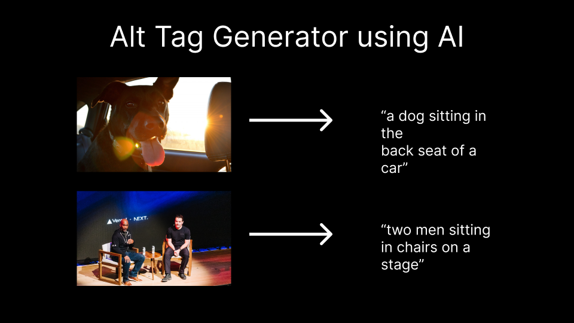

# Alt Image Generator

[](https://vercel.com/new/clone?repository-url=https://github.com/nutlope/alt-text-generator&env=REPLICATE_API_KEY&project-name=alt-tag-generator&repo-name=alt-tag-generator)

This Flask API will generate a description for any image using AI. If you're looking for the TypeScript version, [click here](https://github.com/vercel/examples/tree/main/solutions/alt-tag-generator).



## How it works

This project uses an ML modal from Salesforce called [BLIP](https://github.com/salesforce/BLIP) on [Replicate](https://replicate.com/) to generate relevant alt text for images. You can feed the Flask API endpoint an image as a query param and it will return a one sentence description of that image.

## Running Locally

After cloning the repo, go to [Replicate](https://replicate.com/) to make an account and put your API key in `.env`.

Then, run the following in the command line and your application will be available at `http://localhost:3000`

```bash
npm i -g vercel
vercel dev
```

To use the API route, go to the link below in your browser or run a curl command in your terminal to get a sample result. Feel free to replace the dub.sh link with a link to any image.

```bash
curl http://localhost:3000/generate?imageUrl=https://dub.sh/confpic
```
