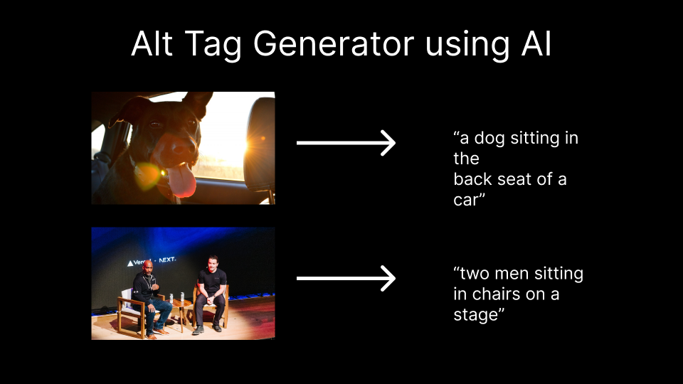

# AI Alt Image Generator

This project will generate relevant alt text for images using AI.



## How it works

This project uses an ML modal called [BLIP](https://github.com/salesforce/BLIP) on [Replicate](https://replicate.com/) to generate relevant alt text for images. You can feed it an image as a query param and it will return a one sentence description of that image.

## Running Locally

After cloning the repo, go to [Replicate](https://replicate.com/) to make an account and put your API key in `.env`.

Then, run the following in the command line and your application will be available at `http://localhost:3000`

```bash
npm i -g vercel
vercel dev
```

To use the API route, go to the link below in your browser or run a curl command in your terminal to get a sample result. Feel free to replace the dub.sh link with a link to any image.

```bash
curl http://localhost:3000/generate?imageUrl=https://dub.sh/confpic
```

## One-Click Deploy

Deploy the example using [Vercel](https://vercel.com?utm_source=github&utm_medium=readme&utm_campaign=vercel-examples):

[](https://vercel.com/new/clone?repository-url=https%3A%2F%2Fgithub.com%2Fvercel%2Fexamples%2Ftree%2Fmain%2Fpython%2FgenerateAltTags)
